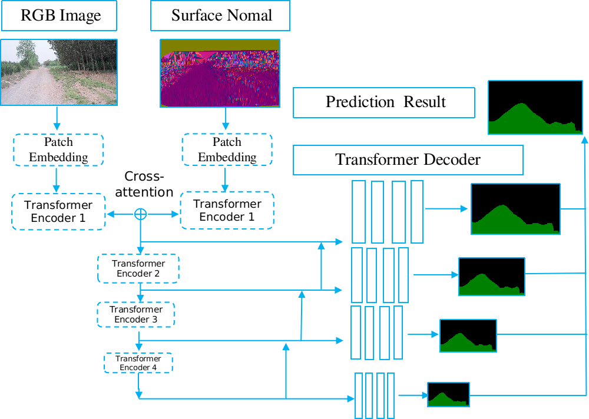

# ORFD: A Dataset and Benchmark for Off-Road Freespace Detection

Repository for the ICRA 2022 paper ["ORFD: A Dataset and Benchmark for Off-Road Freespace Detection"](xxx).

## Introduction
Freespace detection is an essential component of autonomous driving technology and plays an important role in trajectory planning. In the last decade, deep learning based freespace detection methods have been proved feasible. However, these efforts were focused on urban road environments and few deep learning based methods were specifically designed for off-road freespace detection due to the lack of off-road dataset and benchmark. In this paper, we present the ORFD dataset, which, to our knowledge, is the first off-road freespace detection dataset. The dataset was collected in different scenes (woodland, farmland, grassland and countryside), ndifferent weather conditions (sunny, rainy, foggy and snowy) and different light conditions (bright light, daylight, twilight, darkness), which totally contains 12,198 LiDAR point cloud and RGB image pairs with the traversable area, non-traversable area and unreachable area annotated in detail. We propose
a novel network named OFF-Net, which unifies Transformer architecture to aggregate local and global information, to meet the requirement of large receptive fields for freespace detection task. We also propose the cross-attention to dynamically fuse LiDAR and RGB image information for accurate off-road freespace detection.
<p align="center">
demo 1
</p>
<p align="center">
demo 2
</p>
<p align="center">
demo 3
</p>
<p align="center">

</p>


## Requirements

- python 3.6
- pytorch 1.7
- pip install mmcv, mmsegmentation
- pip install mmcv-full==1.3.16 -f https://download.openmmlab.com/mmcv/dist/cu110/torch1.7.0/index.html

## Pretrained models

The pretrained models of our OFF-Net trained on ORFD dataset can be download [here](https://drive.google.com/drive/folders/1lnm2M1HEkVs9W3-FSEX3ddE9GYz4rqCU). 

## Prepare data

The proposed off-road freespace detection dataset ORFD can be found [here](https://pan.baidu.com/s/13lQD8qBmsdSfpOgW18fA-g) (TO BE SOON). Extract and organize as follows:

```
|-- datasets
 |  |-- ORFD
 |  |  |-- training
 |  |  |  |-- sequence   |-- calib
 |  |  |                 |-- sparse_depth
 |  |  |                 |-- dense_depth
 |  |  |                 |-- lidar_data
 |  |  |                 |-- image_data
 |  |  |                 |-- gt_image
 ......
 |  |  |-- validation
 ......
 |  |  |-- testing
 ......
```

## Usage

### Demo ###
```
bash ./scripts/demo.sh
```
### Training
```
bash ./scripts/train.sh
```
### Testing

```
bash ./scripts/test.sh
```
##  License

Our code and dataset are released under the Apache 2.0 license.

## Acknowledgement

This repository is based on [SNE-RoadSeg](https://github.com/hlwang1124/SNE-RoadSeg) [1], and  [SegFormer](https://github.com/NVlabs/SegFormer) [2].

## References

[1] Fan, Rui, et al. "Sne-roadseg: Incorporating surface normal information into semantic segmentation for accurate freespace detection." *European Conference on Computer Vision*. Springer, Cham, 2020. 

[2] Xie, Enze, et al. "SegFormer: Simple and efficient design for semantic segmentation with transformers." Advances in Neural Information Processing Systems 34 (2021).
